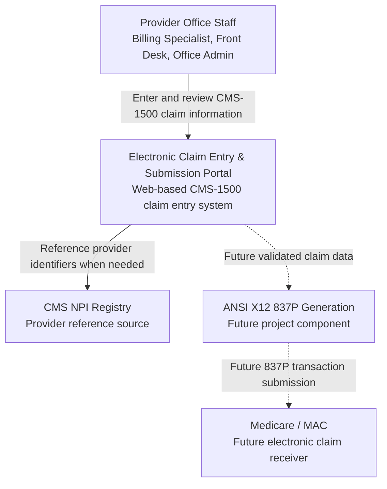
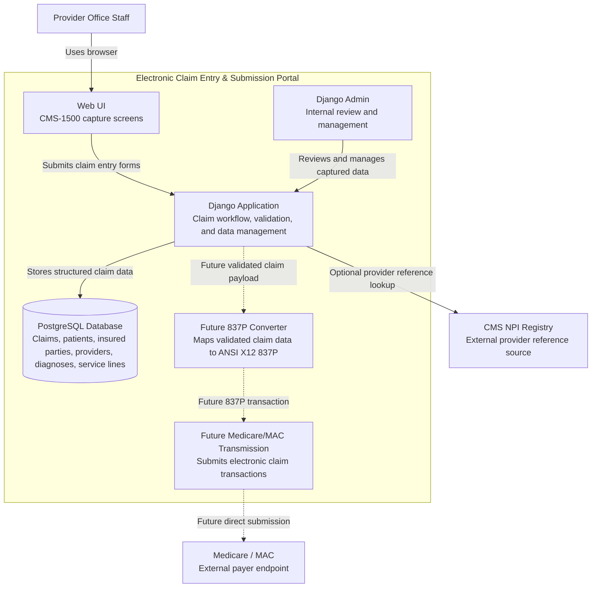

# C4 Model Architecture Notes

This document records the initial C4 Model architecture for the EMRTS Electronic Claim Entry & Submission Portal.

The current assigned scope is the CMS-1500 capture group: building the web interface and PostgreSQL database design needed to capture professional claim information. ANSI X12 837P generation and Medicare/MAC transmission are included as future-facing containers so the documentation remains aligned with the larger project direction.

## Level 1: System Context Diagram

## Level 2: Container Diagram

## Initial Container Responsibilities

| Container | Responsibility |
| --- | --- |
| Web UI | Presents CMS-1500-style claim capture screens for provider office staff. |
| Django Application | Handles claim entry workflow, validation rules, persistence, and admin integration. |
| PostgreSQL Database | Stores structured claim data, patient and insured information, provider information, diagnosis codes, service lines, and audit fields. |
| Django Admin | Provides an internal backend interface for reviewing and managing captured data during development. |
| Future 837P Converter | Converts validated claim data into ANSI X12 837P format in a later project phase. |
| Future Medicare/MAC Transmission | Handles direct Medicare/MAC transmission in a later project phase. |

## Notes

- The current implementation scope is CMS-1500 information capture and PostgreSQL database design.
- The 837P converter and Medicare/MAC transmission containers are included to show how the current work will connect to the larger claim submission workflow later.
- Mermaid diagrams are used so GitHub can render architecture diagrams directly in Markdown and keep documentation close to the code.
