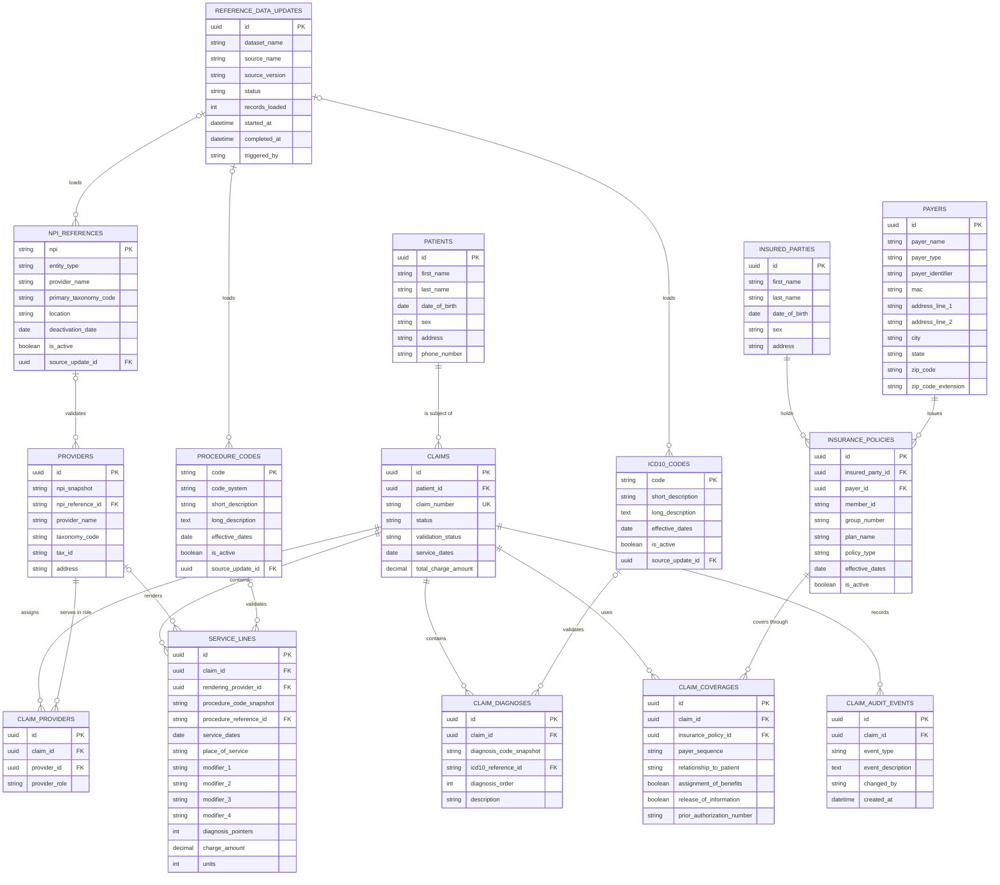

# CMS-1500 Claim Capture ERD

This logical data model combines normalized CMS-1500 claim and coverage records with focused reference entities for NPI, ICD-10-CM, and CPT / HCPCS validation.

## ERD

## How to read the design

The model has three clear areas:

1. **Reusable identity and coverage:** `patients`, `insured_parties`, `payers`, and `insurance_policies` can be maintained before a claim is entered.
2. **CMS-1500 transaction capture:** `claims` is the aggregate root; coverage, provider roles, diagnoses, service lines, and audit events belong to it.
3. **Reference validation:** three focused code tables validate claim-time values, while one shared update table records source, version, count, status, and timestamps.

## Important modeling decisions

- The original `npi`, `diagnosis_code`, and `procedure_code` strings remain on transactional rows as **claim-time snapshots**. Nullable reference keys add validation and descriptions without rewriting history when an external code set changes.
- A claim can own any number of service-line records. The web capture workflow adds lines dynamically instead of enforcing the paper form's six-line layout limit.
- `service_lines.rendering_provider_id` is a direct relationship because rendering provider information is service-line context (CMS-1500 Item 24J).
- The four diagnosis-pointer columns are retained because they directly represent CMS-1500 Item 24E's bounded positions 1–4. A separate join table would add complexity without improving this bounded relationship.
- `claim_coverages` separates a claim from a reusable insurance policy and supports primary, secondary, and tertiary coverage without duplicating subscriber and payer data.

## Extension points

`reference_data_updates` provides a clean integration point for scheduled downloads and bulk loaders. The normalized claim aggregate provides the structured source needed for 837P transformation, transmission tracking, and acknowledgement processing as those workflows are introduced.

## Official source context

- [CMS Medicare Claims Processing Manual, Chapter 26](https://www.cms.gov/regulations-and-guidance/guidance/manuals/internet-only-manuals-ioms-items/cms018912)
- [CMS NPPES downloadable files](https://download.cms.gov/nppes/NPI_Files.html)
- [CMS ICD-10 files](https://www.cms.gov/medicare/coding-billing/icd-10-codes)
- [CMS HCPCS quarterly updates](https://www.cms.gov/medicare/coding-billing/healthcare-common-procedure-system/quarterly-update)
