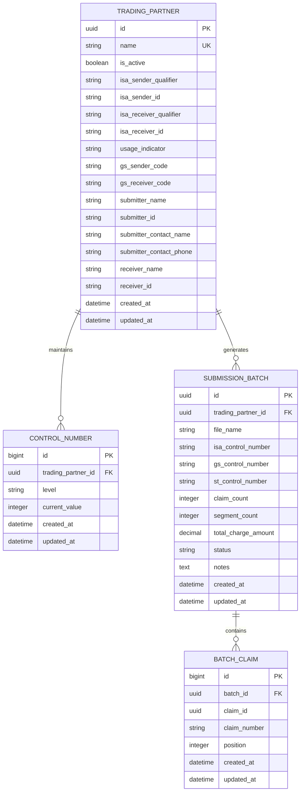

```mermaid
erDiagram
    TRADING_PARTNER ||--o{ CONTROL_NUMBER : maintains
    TRADING_PARTNER ||--o{ SUBMISSION_BATCH : generates
    SUBMISSION_BATCH ||--o{ BATCH_CLAIM : contains

    TRADING_PARTNER {
        uuid id PK
        string name UK
        boolean is_active
        string isa_sender_qualifier
        string isa_sender_id
        string isa_receiver_qualifier
        string isa_receiver_id
        string usage_indicator
        string gs_sender_code
        string gs_receiver_code
        string submitter_name
        string submitter_id
        string submitter_contact_name
        string submitter_contact_phone
        string receiver_name
        string receiver_id
        datetime created_at
        datetime updated_at
    }

    CONTROL_NUMBER {
        bigint id PK
        uuid trading_partner_id FK
        string level
        integer current_value
        datetime created_at
        datetime updated_at
    }

    SUBMISSION_BATCH {
        uuid id PK
        uuid trading_partner_id FK
        string file_name
        string isa_control_number
        string gs_control_number
        string st_control_number
        integer claim_count
        integer segment_count
        decimal total_charge_amount
        string status
        text notes
        datetime created_at
        datetime updated_at
    }

    BATCH_CLAIM {
        bigint id PK
        uuid batch_id FK
        uuid claim_id
        string claim_number
        integer position
        datetime created_at
        datetime updated_at
    }
```
